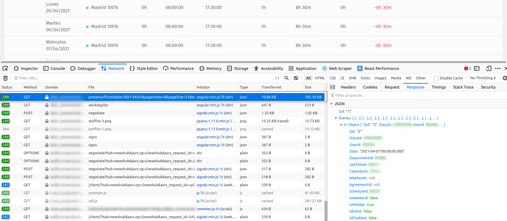

# Woffu WorkReport

This simple CLI Tool is intended to be useful for those people who find some issues in the Woffu time tracker application in order to calculate correctly the working time within a month.

## Motivation

I've discovered when you stop your working time for lunch and it's minor than 1 hour (I think this span is customizable by the company) the calculated time is incorrect.

## How to use it

It's written in NodeJS, so you will need NodeJS in your computer, and then you can simply call it like this:

```
node index.js <json_report_file_from_woffu>
```

The generated report will have the following format:

```
Woffu Reporter
report file: /home/mtenrero/Desktop/fichaje1.json
3/3 -> + 08h 35min  |  [+ 00h 06min]
4/3 -> + 08h 01min  |  [- 00h 29min]
5/3 -> + 07h 49min  |  [+ 00h 50min]
8/3 -> + 08h 30min  |  [+ 00h 00min]
9/3 -> + 08h 35min  |  [+ 00h 05min]
10/3 -> + 08h 30min  |  [+ 00h 00min]
15/3 -> + 08h 31min  |  [+ 00h 01min]
16/3 -> + 08h 30min  |  [+ 00h 00min]
17/3 -> + 08h 31min  |  [+ 00h 01min]
18/3 -> + 08h 33min  |  [+ 00h 03min]
22/3 -> + 08h 31min  |  [+ 00h 02min]
23/3 -> + 08h 35min  |  [+ 00h 06min]
24/3 -> + 06h 59min  |  [- 01h 30min]
25/3 -> + 08h 39min  |  [+ 00h 10min]
26/3 -> + 07h 15min  |  [+ 00h 15min]
29/3 -> + 08h 33min  |  [+ 00h 04min]
30/3 -> + 08h 28min  |  [- 00h 01min]
31/3 -> + 08h 41min  |  [+ 00h 12min]
Total Diff: - 00h 06min
```

### Obtaining Woffu Worktime File

You have to login into your woffu account, and then navigate to **My presence**, open developer tools, Go to Network Requests, and download the contents of the appropriate file:



## Modify Working time:

You can modify any VAR inside analyzer.js file according to your company requirements